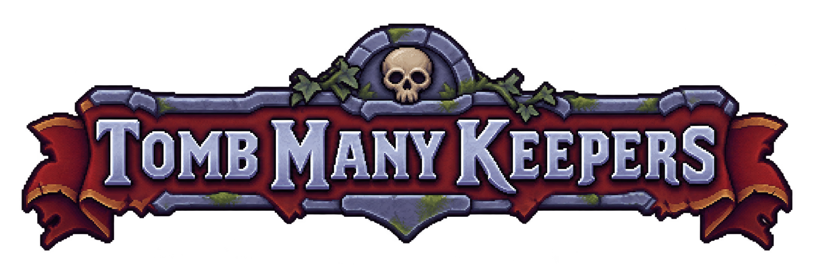

<p align="center">
  
</p>

An unofficial GYK2 mod, porting features from
[GYK: Back From the Grave](https://github.com/ZlordHUN/GYK-Back-From-The-Grave) and [Graveyard Keeper Multiplayer](https://github.com/Zonda001/graveyard-keeper-multiplayer).
**Version 0.1.**

## Features

- Experimental co-op for up to four players over Steam or LAN, with new/saved campaigns and late joining.
- Server browser with ping, favorites, passwords and Steam invitations; configurable lobbies with chat and shared loading screens.
- Persistent characters with personal inventories, points, talents and buffs.
- Multiplayer prison opening; rescue the other keepers with the pickaxe.
- Shared quests, unlocks and reputation, with story rewards for each player.
- Synced world objects, drops, NPCs, time and weather; shared chests and crafting stations used by one player at a time.
- Shared cutscenes, speech and dialogue choices within the same scene.
- Other players' name tags with coloured outlines and matching names in lobby chat.
- Individual sleeping; time advances quickly only when everyone sleeps.
- Pause-menu **Save Game** and **Load Game**, with named new saves and overwriting existing saves.
- Widescreen and ultrawide support, animated menu artwork and resolutions through 8K, including closer **x3** views at **3440×1440** and **5120×1440**.
- Mod title beneath the game's logo and a **Mods** menu with settings for installed plugins.
- Settings rows centred across languages; left-click or Space to skip startup logos.

Choose **Multiplayer → Host Game**, select a campaign, then **Next** to choose
the player limit (2–4) and access settings. **Next** opens the lobby. Guests use
**Join Game → Internet** or **LAN**, select a game and **Connect**, then **Ready**.
With guests present, everyone—including the host—selects **Ready**; ready avatars
have gold outlines. The host then selects **Start Game**. A host alone can start
immediately. Late joiners select **Ready → Join Game**. Right-click a listing to
add it to **Favorites**.

**Visibility:** Public and Password games appear on the Internet tab. Friends
games accept the host's Steam friends over LAN; Private games require an invite.
Use **Invite** in the lobby, or its friends list on wide screens. Invites bypass
passwords and currently require LAN/VPN access. The Friends browser tab, lobby
codes, keeper customization and Cheats are unfinished. **Sample** listings are
previews and cannot be joined.

The host saves everyone's characters. A guest's **Save Game** asks the host to
save; everyone sees the saving indicator. Only the host has **Load Game** during
co-op: active players load the selected campaign together, restoring their saved
characters. New manual saves are separate snapshots; autosaves keep using the
current slot. Keep `.tmk`, `.tmkhost`, `.tmkname` and `.tmkcolors` sidecars with
campaign backups.
Workers, player trading and dungeon fighting levels are not supported yet.
The session ends when the host leaves.

Under **Mods → Tomb Many Keepers**, widescreen support, multiplayer and manual
saves can each be turned off after a restart. Existing files and saves are kept.

## Potential issues

- Overlapping station access may duplicate shared materials.
- Shared-account reconnects may select the wrong character.
- Concurrent world updates may lose changes or desynchronize players.
- LAN Friends checks can rely on an unverified Steam identity.
- Logs may contain invite keys; `.tmkhost` stores the password in plain text.

## Install

Requires **Graveyard Keeper 2 1.006** (Windows Mono)
and **BepInEx 5.4.23.5 x64**, with Steam running for multiplayer.
Every player needs the same `GYK2.TombManyKeepers.dll` and game version. The mod
stays at 0.1; the browser flags incompatible builds or game versions and explains
the mismatch when joining. Internet connections use Steam networking; LAN uses
UDP ports **34271** (discovery) and **34272** (game connection).

Close the game and extract the [nightly release](https://github.com/ZlordHUN/GYK2-Tomb-Many-Keepers/releases/tag/nightly)
into the game folder. Keep only one copy of the plugin; remove any old
`GYK2.Multiplayer.dll`. Remove `GYK2.TombManyKeepers.dll` to uninstall.

## Build

Install the **.NET 8 SDK**. Copy `build/Local.props.example` to `build/Local.props`
and set your game and BepInEx paths, then run:

```sh
dotnet build GYK2.TombManyKeepers.csproj -c Release
```

Output: `bin/Release/netstandard2.1/GYK2.TombManyKeepers.dll`.
Build and test locally, then commit the DLL with your source changes. Nightlies
package that DLL after each push to the default branch.

Licensed under [MIT](LICENSE).
